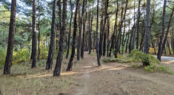
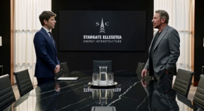
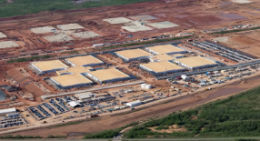
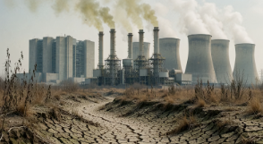
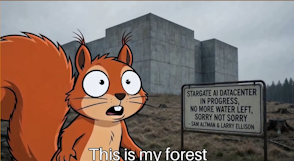
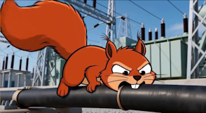
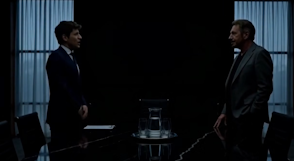
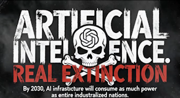

# Climate Action

**My pair partner:** Haki Abdulovski

**Tool we had to use:** ComfyUI

**SDG we had to address:** SDG 13 - Climate Action

## What problem does it solve, and for whom?

OpenAI's Stargate data centre uses on-site gas turbines and backup diesel generators (Floodlight, 2026). The turbines and generators together are permitted to emit more than 1.6 million tons of greenhouse gases per year (Floodlight, 2026). Electricity consumption by data centres is set to nearly double by 2030 (IEA). 30% of the electricity for data centres is currenctly sourced from coal (IEA). Our film uses Stargate as an example to make this hidden physical footprint visible.

Our audience: Dutch students and young adults (18 to 25 years old) who use ChatGPT or other GenAI tools regularly. Our assumption is that for many of them, AI feels like just a chat window: they don't picture the data centre and power plant behind it. 

## What did you build?

A 35-second short film, every one of them generated with the ComfyUI workflow. A cartoon squirrel lives peacefully until the Stargate center rises in his living area. The film uses humour to make an invisible problem visible: the gas plant behind everyday AI use.

## Shot list / storyboard

| Shot | Time | Visual Description | Frame |
|---|---|---|---|
| 1 | 0:00–0:02 | Establishing shot of tranquil pine forest. |  |
| 2 | 0:02–0:05 | 2D vector squirrel bounding; discovers acorn. |  |
| 3 | 0:05–0:11 | Altman & Ellison in high-tech server boardroom. |  |
| 4 | 0:11–0:16 | Drone timelapse of forest cleared for datacenter. |  |
| 5 | 0:16–0:19 | Coal/gas power plant belching exhaust over arid land. |  |
| 6 | 0:19–0:24 | Squirrel confronts brutalist monolith & billboard. |  |
| 7 | 0:24–0:28 | Squirrel enters electrical substation; chews wire. |  |
| 8 | 0:28–0:32 | Boardroom lights short out; executives panic. |  |
| 9 | 0:32–0:34 | Impact stat title card & skull graphic. |  |

## Link to the live thing

Link: https://www.youtube.com/watch?v=MnGeSE4xGQE

## Who did what?

### Haki Abdulovski

Looking up sources, generating images for testing

### Alex Wróbel

Generating main video and images

**Shared work:**

Coming up with ideas, working on powerpoint slides

## Ethical reflection

Informing vs. Misleading:
Reality: The multi-gigawatt energy demand, water depletion, and behind-the-meter gas turbine deployments for Stargate are verified facts.
Dramatization: The brutalist concrete monolith and literal animal sabotage are stylized artistic metaphors used to communicate scale and impact within 30 seconds.
Public Likenesses (Sam Altman & Larry Ellison):
Framed as clear political/corporate parody and satire (Fair Use), avoiding any malicious personal defamation.
In-Video Risk Mitigation:
A persistent "AI-Generated" watermark is burned into the top-right corner of every frame.
Generative Compute Footprint & Justification:
Audit: We ran 78 generation passes across Krea 2 Turbo, Qwen, and MiniMax H3, consuming approximately 2.1 kWh of GPU compute (~0.85 kg CO2).
Justification: Spending 2.1 kWh locally to produce a targeted educational asset that reaches thousands of student AI power-users—encouraging prompt efficiency and querying restraint—yields a net-positive environmental return on investment.

## Sources

This permit, common for dry cleaners, is now being used to build AI power plants

https://floodlightnews.org/ai-data-centers-texas-pollution-loophole/

AI in de samenleving: ervaringen en opinies

https://www.cbs.nl/nl-nl/longread/diversen/2026/ai-in-de-samenleving-ervaringen-en-opinies/2-ervaring-met-ai

Energy demand from AI

https://www.iea.org/reports/energy-and-ai/energy-demand-from-ai

Energy supply for AI

https://www.iea.org/reports/energy-and-ai/energy-supply-for-ai